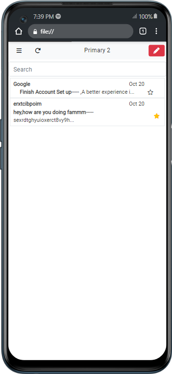

# JavaScript Project - Gmail clone

This is a solution to the Gmail Clone Project,assigned to me by my instructor 

## Table of contents

- [Overview](#overview)
  - [The Project](#The_project)
  - [Screenshot](#screenshot)
  - [Links](#links)
- [My process](#my-process)
  - [Built with](#built-with)
  - [What I learned](#what-i-learned)
  - [Continued development](#continued-development)
  - [Useful resources](#useful-resources)
- [Author](#author)
<!-- - [Acknowledgments](#acknowledgments) -->

## Overview

### The_Project

Users should be able to:

- View the optimal layout for the app depending on their device's screen size
- Create Accounts and Sign in when they have accounts
- Get redirected to their mail Dashboard after a successful sign up or Sign in
- Send email(s) to other registered accounts 
- Open and Read Emails sent and Received
- Star and Unstar Messages as users wish
- Undo a delete Action after deleting

### Screenshot

### Links

- Solution URL: [Github Repo](https://github.com/Damilarr/Gmail-clone)
- Live Site URL: [live site](https://damilarr.github.io/Gmail-clone/)

### my-process

### Built with

- HTML
- CSS custom properties
- Flexbox
- BOOTSTRAP V4
- Mobile-first workflow
- Javascript!!!

### What I learned

While doing this Project I've been able to LEARN new BOOTSTRAP properties and while working with Javascript I've been able to learn to satifaction,Working with Array and Objects.
I used the Arrays to store details and other Info i got from the user and I've been able to display information on the pagew with respect to the current User.

### Continued development

I Plan to implement more functionalties like Snoozing a mail for a period of time and Other functions which are implemented in the Gmail App.
Also plan to implement sending mails to multiple users

## Author

- Website - [EMMANUEL](https://github.com/Damilarr)
- Twitter - [@Emmdam4](https://www.twitter.com/Emmdam4)